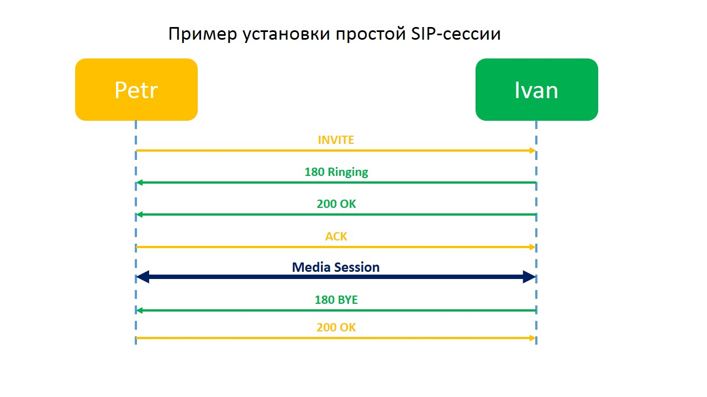

# VoIP Honeypot

Ловушка, имитирующая поведение VoIP телефонии. Принимает запросы по протоколу udp/tcp и отвечает на запросы: 
- INVITE
- INVITE Authorization
- OPTIONS
- ACK
- BYE
- CANCEL



В дальнейшем надо реализовать rtp соединение для реализации Media Session. Прослушивает порт 5060, 80, 23, и фиксирует каждое соединение в лог файле, и в json-файле.

## Ссылки
- [voip-hpc](https://github.com/tobiw/voip-hpc)
- [honeysip [fork of voip-hpc]](https://github.com/mushorg/honeysip)
- [Зубодробильный документ по стандартам SIP [RFC 3261]](https://tools.ietf.org/html/rfc3261)
- [описание эмулируемого телефона D-Link DPH-150S](https://www.dlink.ru/ru/products/8/2189.html)

## Запуск
- `docer-compose up`

## Планы:
- [x] реализовать tcp протокол
- [ ] RTP соединение для передачи звука
- [x] В случае неправильной авторизации, возвращать ответы `400 Bad Request` или `481: b"Call/Transaction Does Not Exist",`
- [x] Доделать обманку для nmap

## Аппарат D-Link DPH-150S
##### Сигнальные, медиа и сетевые протоколы
- SIP RFC 3261
- SDP RFC 2327
- RTP RFC 1889
- SNTP
- DNS & DNS SRV
- TFTP/FTP/HTTP для автоконфигурирования
- IP/TCP/UDP/ARP/ICMP

## Примеры входящих сообщений:
```
=== OPTIONS ===
    OPTIONS sip:127.0.0.1 SIP/2.0
    Via: SIP/2.0/TCP 127.0.0.1:39338;rport;branch=z9hG4bKhKcExzavijtat7swla_1z84oc
    Max-Forwards: 70
    From: "Nmap NSE" <sip:user@127.0.0.1>;tag=vN3pq0L0SQnHqXpPGF9D
    To: "Nmap NSE" <sip:user@127.0.0.1>
    Call-ID: 9561yUXyBJAPZ3aaLmruyZhzw7B2gnsfinWW8tJ93JORCosOPZ8Dzf2kb4c8
    CSeq: 1234 OPTIONS
    User-Agent: Nmap NSE
    Contact: "Nmap NSE" <sip:user@127.0.0.1:39338>
    Expires: 300
    Allow: PRACK, INVITE ,ACK, BYE, CANCEL, UPDATE, SUBSCRIBE,NOTIFY, REFER, MESSAGE, OPTIONS
    Accept: application/sdp
    Content-Length:  0

=== INVITE ===
    INVITE sip:100@localhost SIP/2.0
    Via: SIP/2.0/UDP 127.0.0.1:5060;branch=z9hG4bK87asdks7
    From: socketHelper
    To: 100@localhost
    Call-ID: 1395
    CSeq: 2 INVITE
    Contact: socketHelper
    Accept: application/sdp
    Content-Type: application/sdp
    Content-Length: 126

    v=0
    o=socketHelper 5566 7788 IN IP4 127.0.0.1
    s=SDP Subject
    i=SDP information
    c=IN IP4 127.0.0.1
    t=0 0
    m=audio 30123 RTP/AVP 0

=== INVITE Authorization ===
    INVITE sip:100@localhost SIP/2.0
    Via: SIP/2.0/UDP 127.0.0.1:5060;branch=z9hG4bK87asdks7
    From: socketHelper
    To: 100@localhost
    Call-ID: 4512
    CSeq: 3 INVITE
    Contact: socketHelper
    Accept: application/sdp
    Content-Type: application/sdp
    Content-Length: 126
    Authorization: Digest username="100",
                   realm="100@localhost",
                   uri="sip:100@localhost",
                   nonce="a6b103fbb266224691906c0a60c41849",
                   response="dea6001bb802e6619a89cd5cf8d5d227"

    v=0
    o=socketHelper 5566 7788 IN IP4 127.0.0.1
    s=SDP Subject
    i=SDP information
    c=IN IP4 127.0.0.1
    t=0 0
    m=audio 30123 RTP/AVP 0
```
